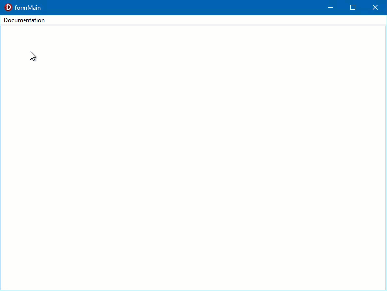
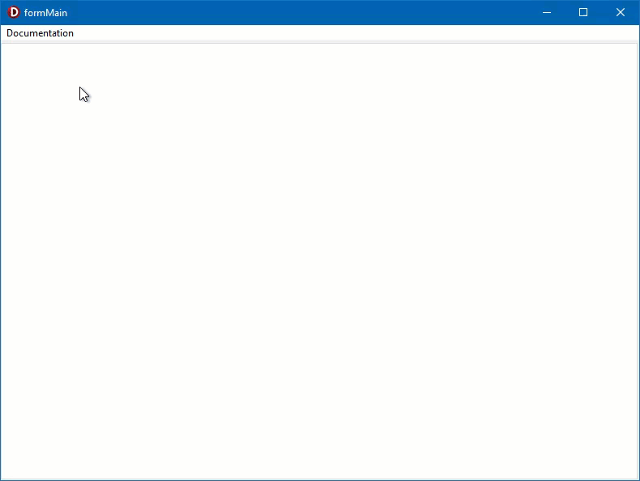

# EdgeZipServer

## What's this
PoC of my way of storing and organizing a html documentation in zip archive and displaying it in your application by using TEdgeBrowser wrap class `TEdgeZipServer`.

## How it works
Library handles `TCustomEdgeBrowser.OnWebResourceRequested` request and loads files from ZIP archive you specified.

## How to use
* Prepare your dev environment by Embarcadero guide [Using TEdgeBrowser Component and Changes to the TWebBrowser Component](https://docwiki.embarcadero.com/RADStudio/Alexandria/en/Using_TEdgeBrowser_Component_and_Changes_to_the_TWebBrowser_Component).
* Link [UEdgeBrowserZipServer.pas](Library/UEdgeBrowserZipServer.pas) file in your project and assign class `TEdgeZipServer` to any `TEdgeBrowser` control.

## Demos
Check out [Demos](Demos/) folder for examples of usage. 

### Basic Demo
Loading file from zip archive.

### Advanced Demo
More advanced example of using `TEdgeZipServer` class.

### LoadFromResource
Example of storing ZIP archive as exe resource and loading data from it.

### Used templates
#### Demo 1.zip
[iDocs](https://github.com/harnishdesign/iDocs) - one page documentation html template.

#### Demo 2.zip
[Doctemplate](https://github.com/charlyllo/doctemplate) - A simple HTML/CSS documentation template.

#### Demo 3.zip
[HelpNDoc](https://www.helpndoc.com/) - modern help authoring tool with an intuitive user interface.

#### Demo 4.zip
[ReadTheDocs](https://docs.readthedocs.io/en/stable/downloadable-documentation.html) - Downloadable Documentation of online version of ReadTheDocs.

#### Demo 5.zip
[chm-html](https://github.com/krogank9/chm-html) - Python CHM compiler that outputs an HTML5 powered CHM browser packaged with the CHM's data. Documentation of [kbengine](https://github.com/kbengine/kbengine) as example of CHM help project.

#### Demo 6.zip
[itinerary-html-template](https://github.com/harnishdesign/itinerary-html-template) - Itinerary HTML template. Example of loading custom data into static HTML content.

### Sneak peek

